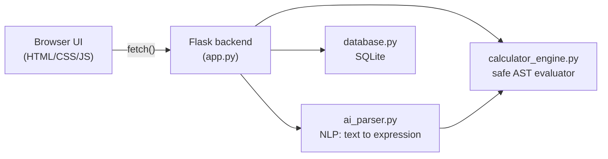

# Smart Calculator

A full-stack calculator built to touch every layer of an app: **frontend**,
**backend**, **database**, and a lightweight **AI/NLP** layer that
understands plain-English math questions.

You can press buttons like a normal calculator, or just type
*"what is the square root of 81 plus 4"* and it'll work that out too.

## Features

- **Standard calculator** — the usual buttons, plus `sqrt`, `%`, parentheses, and order of operations
- **Natural-language input** — ask a question in plain English and it's parsed into a real expression before being evaluated
- **Persistent history** — every calculation is saved to a SQLite database and shown in the UI
- **Usage stats** — a small analytics endpoint reports your most-used operator
- **Safe by design** — expressions are evaluated with Python's `ast` module, never with `eval()`, so arbitrary code can't be injected through the calculator

## Architecture



**Why rule-based NLP instead of an LLM API?** It keeps the project free,
fast, and fully self-contained — no API keys, no internet dependency at
runtime, and it's easy to read and extend as you learn more NLP. Swapping
in a real language model later (see *Future improvements*) is a natural
next step once this foundation is solid.

## Project structure

```
smart-calculator/
├── app.py                   # Flask routes (the "backend")
├── calculator_engine.py     # Safe math expression evaluator
├── ai_parser.py             # Natural-language -> expression parser (the "AI")
├── database.py              # SQLite history + stats (the "database")
├── templates/
│   └── index.html           # Page markup
├── static/
│   ├── style.css            # Styling
│   └── script.js            # Frontend logic (the "frontend")
├── tests/
│   └── test_calculator.py   # Unit tests
├── requirements.txt
├── Procfile                 # For Railway / Heroku-style platforms
├── render.yaml               # For Render.com
└── .gitignore
```

## Running it locally

Requires Python 3.9+.

```bash
git clone https://github.com/<your-username>/smart-calculator.git
cd smart-calculator
python -m venv venv
source venv/bin/activate        # Windows: venv\Scripts\activate
pip install -r requirements.txt
python app.py
```

Open **http://127.0.0.1:5000** in your browser. A `calculator.db` SQLite
file is created automatically on first run.

## Running the tests

```bash
python -m unittest discover tests -v
```

## API reference

| Method | Route                     | Body                        | Description                       |
|--------|----------------------------|------------------------------|------------------------------------|
| POST   | `/api/calculate`           | `{"expression": "5 + 3"}`   | Evaluate a math expression         |
| POST   | `/api/calculate/natural`   | `{"query": "5 plus 3"}`     | Parse + evaluate a plain-English question |
| GET    | `/api/history?limit=20`    | —                             | Recent calculations                |
| DELETE | `/api/history`             | —                             | Clear history                      |
| GET    | `/api/stats`                | —                             | Basic usage analytics              |

Example:

```bash
curl -X POST http://127.0.0.1:5000/api/calculate/natural \
  -H "Content-Type: application/json" \
  -d '{"query": "what is the square root of 81 plus 4"}'
# {"success": true, "query": "...", "parsed_expression": "sqrt(81) + 4", "result": 13}
```

## Deployment

The app is a single Flask service (it serves its own frontend), which
keeps deployment simple. **Render.com** is the easiest free option:

1. Push this project to a GitHub repository.
2. Go to [render.com](https://render.com) → **New** → **Web Service** → connect your repo.
3. Render will detect `render.yaml` automatically and configure the build/start commands for you. If asked manually, use:
   - Build command: `pip install -r requirements.txt`
   - Start command: `gunicorn app:app`
4. Deploy. Render gives you a live `https://smart-calculator-xxxx.onrender.com` URL.

**Railway** or **Heroku** work the same way and will use the included
`Procfile` (`web: gunicorn app:app`).

> **Note on the database:** SQLite writes to the local filesystem, which
> most free hosting tiers reset on redeploy. That's fine for a portfolio
> demo. For a version where history should never be lost, swap
> `database.py` to use PostgreSQL (e.g. Render's free Postgres add-on)
> instead of SQLite — the function signatures in `database.py` are kept
> intentionally simple to make that swap easy later.

## Future improvements

- Swap the rule-based `ai_parser.py` for a small trained intent classifier, or an actual LLM API call, and compare accuracy
- Add user accounts so history is per-person instead of shared
- Move from SQLite to PostgreSQL for durable, multi-instance deployments
- Add a "steps" mode that shows how an expression was evaluated, not just the result

## Tech stack

Python · Flask · SQLite · vanilla HTML/CSS/JS · Gunicorn
